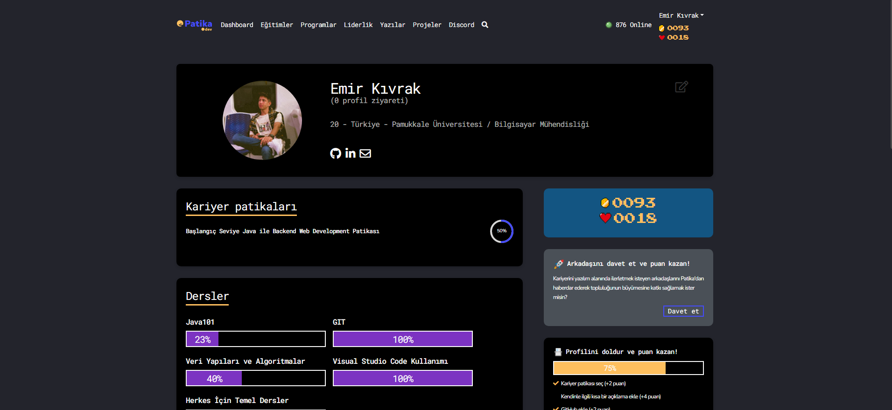

# Patika Java 101

Patika.dev Java 101 eğitimi kapsamında hazırlanmış, programlama temellerini gösteren Java alıştırmaları koleksiyonudur.

> **Durum:** Eğitim arşivi — çalışma tamamlanmış olup düzenli geliştirme planlanmıyor.

## Kapsam

Depoda 55 Java kaynak dosyası ve çok sayıda bağımsız alıştırma bulunur. Örnek konular:

- koşullar, döngüler ve temel hesaplamalar
- diziler, metotlar ve özyineleme
- sınıflar ile küçük nesne yönelimli örnekler
- hesap makinesi, ATM ve basit oyun gibi konsol uygulamaları

Her klasör, genellikle kendi giriş sınıfına sahip ayrı bir çalışmadır.

## Görsel



## Kaynak koddan çalıştırma

Bu depoda ortak bir Maven veya Gradle projesi yoktur. Çalıştırmak istediğiniz alıştırmanın klasörünü bir Java IDE'sinde açın ve ilgili `main` metodunu içeren sınıfı çalıştırın.

Örnek:

```text
PatikaJava101/
└── ATMProjesi/
    └── ATMProjesi.java
```

Java geliştirme kiti ve tercih ettiğiniz bir Java IDE'si yeterlidir. Alıştırmaların her biri bağımsız olduğundan tek bir toplu test veya paketleme komutu bulunmaz.

## Kaynak

- [Patika Java 101 kursu](https://app.patika.dev/courses/java101)
